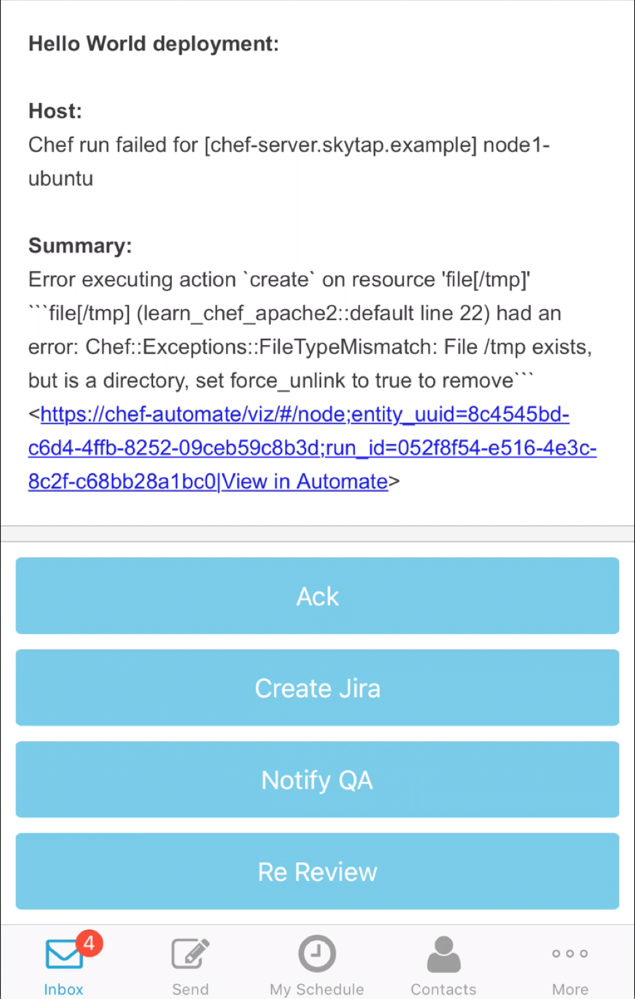

# Chef Server
Whether you have five or five thousand servers, Chef lets you manage them all by turning infrastructure into code. Infrastructure described as code is flexible, versionable, human-readable, and testable. This guide instructs you how to implement an integration between xMatters and Chef Server at the Recipe level.

# Pre-Requisites
* Chef Recipe or Chef custom Event Handler.  See the following Chef documentation for instructions on how to configure a custom Event Handler.  [Chef Event Handler Help Docs](https://docs.chef.io/handlers.html)  
* xMatters account - If you don't have one, [get one](https://www.xmatters.com)!

# Files
* [ChefServer.zip](ChefServer.zip) - The comm plan that has all the cool scripts and email format and such. 

# Installation
## xMatters set up
1. Import the [ChefServer.zip](ChefServer.zip) Communication Plan.
3. Navigate to the Integration Builder tab and click the `Inbound from Chef Recipe` link. Copy the URL at the bottom and set aside.
4. Create a group in xMatters and add the appropriate users to the group. [xMatters Groups](https://help.xmatters.com/OnDemand/groups/groups.htm). The name of the group is referenced in the inbound integration script with these lines of code:
```javascript
// Define recipients
var recipients = [];
// Add a recipient targeting a user or group
recipients.push({
    'targetName': 'chef'
});
```

## Chef Recipe or Chef Custom Event Handler
1. Edit the default Recipe of the cookbook/cookbooks or the Custom Event Handler cookbook and add the following Ruby code:
```
if File::exists?('/tmp')
	puts "Error"
	http_request 'posting data' do
 		action :post
		url '<XMATTERS_INBOUND_INTEGRATION_URL_HERE>'
 		# message ({:some => 'data'}.to_json)
 		message ({:host => node['hostname'], :ip => node['ipaddress'], :cookbook => 'learn_chef_apache2', :status => 'Error with tmp file'}.to_json)
		headers('Content-Type' => 'application/json')
	end
	file '/tmp'
else
	puts "..."
end
```
Where `XMATTERS_INBOUND_INTEGRATION_URL_HERE` is the url for the `Inbound from Chef Recipe` inbound integration copied from above.

* If the code is executed in a Recipe, access to run variables is limited to the following Automatic (Ohai) attributes. [Chef Cookbook/Recipe Automatic Attributes](https://docs.chef.io/attributes.html)  
* If a custom Event Handler is used, the run variables can be extended.  See Chef documentation on custom Event Handlers. [Chef Event Handler Help Docs](https://docs.chef.io/handlers.html)
* When dynamic information is sent through via the message value, these values can effect how xMatters processes the information.  For example, depending on the cookbook that executes the above code, different groups could be targeted.  This allows customers to contact different groups/teams depending on the infrastructure layer that failed. 


# Testing
1. Run a Cookbook in Chef that will force the run to fail.
2. A message should come through on your devices.  Which ever devices you have configured in xMatters.
<kbd>

</kbd>

# Troubleshooting
View the Activity Stream in the inbound integration in xMatters to determine issues with Chef payload or connectivity.


